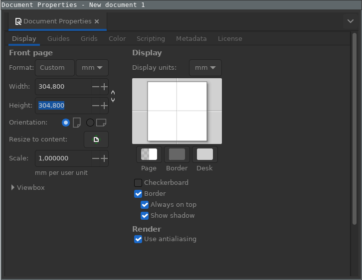

# User Guide

This contains typical usage examples and workflow for users using this plugin.

---

## Prepping new design files

### Setting Inkscape document size to fit Cricut mats

1. Click the `File` menu and then the `Document properties` menu entry
2. Set the current document width and height to `304.8` millimeters (12" cutting mat)
3. Close the dialog window

---

## Plot

1. Open your document with inkscape.
  - Note: documents in px are plotted at 96dpi
2. Convert text objects to paths (Path - Convert object to path)
3. Select the parts you want to plot.
4. Open the extension. If you want to use the same cut settings for all of the paths in your file, use "Extensions -> Export -> Send to Cricut"
5. Set your desired plot parameters. There are numerous aspects you can control with the dialog, here are just the core highlights:
  - **X-Offset, Y-Offset**  An additional offset of your drawing from the top left corner. Default is 0/0
  - **Tool**                *Fine-point blade* mode drews small circles for orientation of the blade, Pen mode draws exactly as given.
  - **Media**               Select a predfined media.
6. To start the cut, in "Send to Cricut, click the "Apply" button.

---

## Design Tips

### Getting an outline of a vector object

1. Path > Break Apart
1. Path > Union
1. Depening on your sticker cutting requirement:
 - Path > Inset
 - Path > Outset
 - Path > Dynamic Offset

### Getting an outline of a bitmap object

1. Path > Trace Bitmap
  1. Use brightness cutoff detection mode. 
  1. Select threshold to get as much detail of the object in the image.
  1. Press Apply
1. Select all the vector outlines that was detected and generated
1. Path > Break Apart
1. Path > Union
1. Depening on your sticker cutting requirement:
 - Path > Inset
 - Path > Outset
 - Path > Dynamic Offset

 
